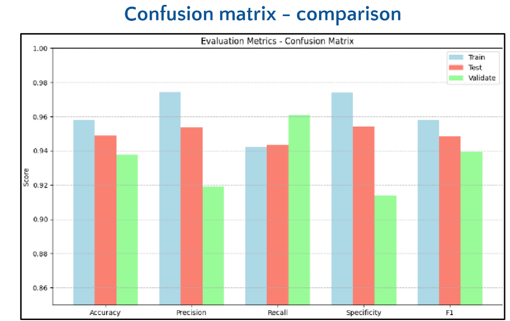
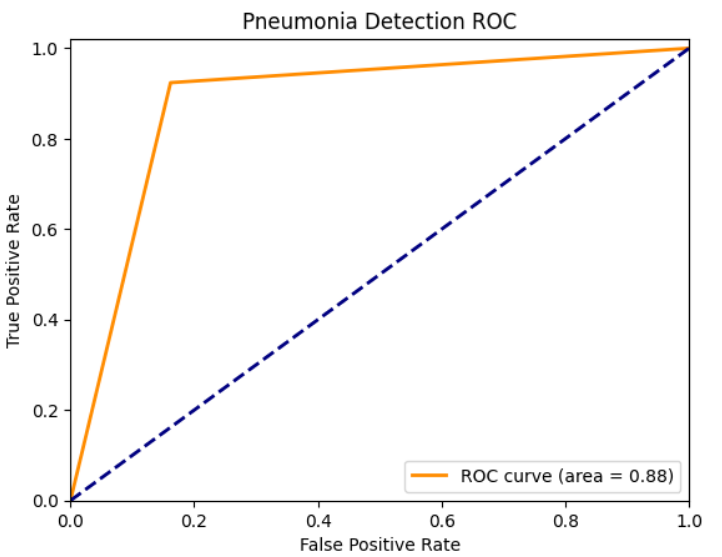

# 🫁 Pneumonia Detection using DenseNet

### Python · DenseNet121 · CNN · Chest X-Ray Classification

---

## 🔍 Overview

This project uses a **DenseNet121-based CNN model** to classify chest X-ray images as **Normal** or **Pneumonia**.

The project demonstrates an end-to-end medical image classification workflow using deep learning, transfer learning, model evaluation, and result visualization.

---

## 🎯 Project Goal

Pneumonia detection from chest X-rays is a real-world healthcare classification problem.

The goal of this project is to explore how DenseNet121 can support automated image-based pneumonia detection from medical X-ray data.

---

## ✨ What This Project Does

| Step | Description |
|---|---|
| Data Loading | Loads chest X-ray image data |
| Preprocessing | Resizes and prepares images for model input |
| Model Building | Uses DenseNet121-based CNN architecture |
| Training | Trains the model for Normal vs Pneumonia classification |
| Evaluation | Reviews model performance using classification metrics |
| Visualization | Displays metric comparison and ROC curve |

---

## 🧠 Model Summary

| Item | Details |
|---|---|
| Architecture | DenseNet121 |
| Model Type | Convolutional Neural Network |
| Task | Binary Image Classification |
| Input | Chest X-ray images |
| Output | Normal / Pneumonia |
| Workflow | Transfer Learning / Deep Feature Learning |

---

## 📊 Results & Visuals

### Evaluation Metrics Comparison

The model was evaluated using accuracy, precision, recall, specificity, and F1-score across training, testing, and validation results.

  

---

### ROC Curve

The ROC curve shows model performance for pneumonia classification, with an AUC score of **0.88**.

  

---

## 🛠️ Tech Stack

| Category | Tools / Methods |
|---|---|
| Language | Python |
| Environment | Jupyter Notebook |
| Deep Learning | TensorFlow / Keras |
| Model | DenseNet121 |
| Data Type | Chest X-ray Images |
| Visualization | Matplotlib |
| Supporting Libraries | NumPy, scikit-learn |

---

## 🧪 Evaluation Focus

| Area | Purpose |
|---|---|
| Accuracy | Measures overall classification correctness |
| Precision | Checks correctness of pneumonia predictions |
| Recall | Measures how well pneumonia cases are detected |
| Specificity | Checks how well normal cases are identified |
| F1-score | Balances precision and recall |
| ROC-AUC | Evaluates classification separation quality |

---

## 👩‍💻 My Role

I worked on this project with a focus on deep learning-based medical image classification.

My work included:

- preparing chest X-ray image data
- building a DenseNet121-based CNN workflow
- training the model for pneumonia detection
- evaluating prediction performance
- visualizing metrics and ROC curve
- documenting the project methodology and results

---

## ▶️ How to Run

1. Clone the repository.

`git clone https://github.com/SHREENITHI-TV/Pneumonia-Detection-using-DenseNet.git`

2. Open the notebook.

`Pneumonia_Detection_using_DenseNet.ipynb`

3. Install required libraries if needed.

`pip install tensorflow keras numpy matplotlib scikit-learn`

4. Run the notebook cells in order.

5. Review model training, evaluation metrics, and ROC curve.

---

## 📁 Repository Structure

| File / Folder | Purpose |
|---|---|
| `Pneumonia_Detection_using_DenseNet.ipynb` | Main notebook for model training and evaluation |
| `Pneumonia.pdf` | Project report documenting methodology and results |
| `screenshots/` | Evaluation plots and result visuals |
| `README.md` | Project documentation |

---

## 📌 Project Relevance

This project demonstrates practical experience with:

- deep learning
- DenseNet121 CNN architecture
- medical image classification
- chest X-ray analysis
- transfer learning workflow
- model evaluation
- healthcare AI experimentation
- result visualization

---

## 🚀 Future Improvements

- Add confusion matrix heatmap
- Add Grad-CAM explainability
- Compare DenseNet with ResNet or EfficientNet
- Build a simple prediction interface

---

### Built to explore pneumonia detection from chest X-ray images using DenseNet121.

